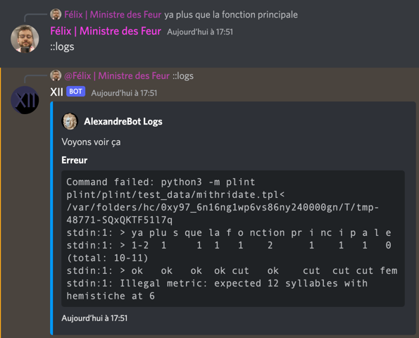

# AlexandreBot

### Ce bot est rigolo, toujours en douze pieds.

Alexandre est un bot basé sur `Node.js`et la librairie publique `discord.js`.

Il détecte à chaque message envoyé sur un salon, si le message est un alexandrin : <br>
le modèle de base est l'Alexandrin de Mithridate, 6 pieds + 6 pieds avec un hémistiche.

Ce bot se base sur le module Python `plint` créé par Antoine Amarilli. <br>
https://pypi.org/project/plint/

## Mise en place

Cloner le repository :
```shell
git clone https://github.com/TuberculeP/AlexandreBot.git
```

Installer `Python3` si ce n’est pas déjà fait : <br>
https://www.python.org/downloads/

Installer les modules nécessaires :

```shell
pip3 install frhyme
pip3 install haspirater
```

Installer Node.js : <br>https://nodejs.org/en/download/

### Dans le dossier du repository ( `AlexandreBot/` ) :

Cloner le repository de `plint`:
```shell
git clone https://a3nm.net/git/plint/
```

Créer votre fichier `.env` contenant le token de votre bot discord

```env
TOKEN=VOTRE_TOKEN_ICI
```

Installer dotenv
```shell
npm install dotenv
```

Installer tmp
```shell
npm install tmp
```

Installer Discord.js

```shell
npm install discord.js
```

## Utilisation

### Lancer le bot

```shell
npm start
```

Le bot réagira maintenant à chaque message en alexandrin avec ✅

Il est possible de demander au bot une explication à un message non détecté. Il suffit de répondre au message concerné et d'écrire `::logs`.

